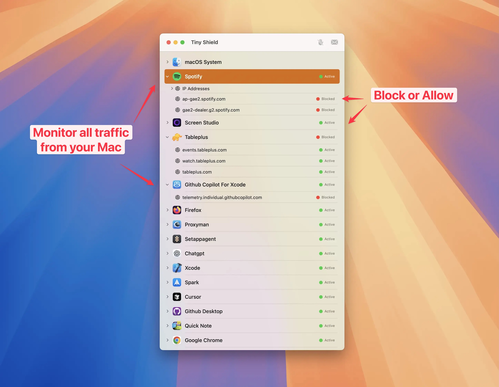

# 🛡️ Tiny Shield Public Bug Tracker

Welcome to the public bug tracker for **Tiny Shield** — the native, modern macOS app that gives you complete control over your Mac’s network connections.

## Key Features

* **Native. Modern. Seamless macOS experience**
* **Simple Perpetual License** (no subscription required)
* **2 Years of Updates** included with every license
* **Active Development** with new builds every month

---

## What Can You Do With Tiny Shield?

| Feature                    | Description                                                                             |
| -------------------------- | --------------------------------------------------------------------------------------- |
| **Network Control**        | Monitor and manage all connections — even system-level.                                 |
| **Block Unwanted Traffic** | Block any app or domain with a single click for privacy and peace of mind.              |
| **Detailed Analytics**     | See IPs, locations, and bandwidth usage in real time.                                   |
| **High Performance**       | Lightning-fast filtering using macOS Network Extension, with virtually no CPU overhead. |

---

## Need Help? 💡

* **Have a question or need support?**
  Email us at [tinyshield@proxyman.com](mailto:tinyshield@proxyman.com).
  
* **Found a bug or have a feature request?**
  Open a new issue here and our team will get back to you!

---

Thank you for helping make Tiny Shield better for everyone!

---

**Proxyman/TinyShield Team**
[[proxyman.io/tinyshield](https://tinyshield.proxyman.com)](https://tinyshield.proxyman.com)
